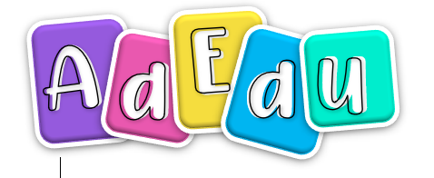

<!-- Improved compatibility of back to top link: See: https://github.com/luisperezmarin/adedu/pull/73 -->
<a name="readme-top"></a>
<!--
*** Thanks for checking out the Best-README-Template. If you have a suggestion
*** that would make this better, please fork the repo and create a pull request
*** or simply open an issue with the tag "enhancement".
*** Don't forget to give the project a star!
*** Thanks again! Now go create something AMAZING! :D
-->


<!-- PROJECT SHIELDS -->
<!--
*** I'm using markdown "reference style" links for readability.
*** Reference links are enclosed in brackets [ ] instead of parentheses ( ).
*** See the bottom of this document for the declaration of the reference variables
*** for contributors-url, forks-url, etc. This is an optional, concise syntax you may use.
*** https://www.markdownguide.org/basic-syntax/#reference-style-links
-->
[![Contributors][contributors-shield]][contributors-url]
[![Forks][forks-shield]][forks-url]
[![Stargazers][stars-shield]][stars-url]
[![Issues][issues-shield]][issues-url]
[![MIT License][license-shield]][license-url]


<!-- PROJECT LOGO -->
<br />
<div align="center">
  <a href="https://github.com/luisperezmarin/adedu">
    
  </a>

<h3 align="center">AdEdu</h3>

  <p align="center">
    Aplicación para la Administración Educativa
    <br />
    <a href="https://github.com/luisperezmarin/adedu"><strong>Explora los documentos »</strong></a>
    <br />
    <br />
    <a href="https://github.com/luisperezmarin/adedu">Ver Demo</a>
    ·
    <a href="https://github.com/luisperezmarin/adedu/issues">Reporte Bugs</a>
  </p>
</div>


<!-- TABLE OF CONTENTS -->
<details>
  <summary>Tabla de Contenido</summary>
  <ol>
    <li>
      <a href="#acerca-del-proyecto">Acerca del Proyecto</a>
      <ul>
        <li><a href="#hecho-con">Hecho con</a></li>
      </ul>
    </li>
    <li>
      <a href="#empezando">Empezando</a>
      <ul>
        <li><a href="#prerequisitos">Prerequisitos</a></li>
        <li><a href="#instalacion">Instalacion</a></li>
      </ul>
    </li>
    <li><a href="#usage">Usage</a></li>
    <li><a href="#roadmap">Roadmap</a></li>
    <li><a href="#contributing">Contributing</a></li>
    <li><a href="#license">License</a></li>
    <li><a href="#contact">Contact</a></li>
    <li><a href="#acknowledgments">Acknowledgments</a></li>
  </ol>
</details>


<!-- ABOUT THE PROJECT -->
## Acerca del Proyecto

[![Product Name Screen Shot][product-screenshot]](https://adedu.com.gt)

Este es un proyecto para el curso de Desarrollo Web, del 7mo ciclo de la carrera de Ingenieria de Sistemas y Ciencias de la Computación de la Universidad Mariano Gálvez de Guatemala.

<p align="right">(<a href="#readme-top">back to top</a>)</p>


### Hecho con

* [![Angular][Angular.io]][Angular-url]
* [![FastAPI][FastAPI]][FastAPI-url]

<p align="right">(<a href="#readme-top">back to top</a>)</p>


<!-- GETTING STARTED -->
## Empezando

Abajo se encontrarán los pasos para la instalación del ambiente de desarrollo de este proyecto.

### Prerequisitos

El siguiente software es necesario para que este proyecto funcione
* [nodejs v18.17.1](https://nodejs.org/en/download)
* [python 3.11.5](https://www.python.org/downloads)
* angular
  ```sh
  npm install -g @angular/cli
  ```
* pnpm
  ```sh
  npm install -g pnpm
  ```
* poetry
  ```sh
  pip install poetry
  ```
### Instalacion

1. Clonar el repositorio
   ```sh
   git clone https://github.com/luisperezmarin/adedu.git
   ```
2. Instalar paquetes de NPM
   ```sh
   cd adedu/adedu-app
   pnpm install
   ```
3. Instalar paquetes de python
   ```sh
   cd ../api
   poetry install
   ```

<p align="right">(<a href="#readme-top">back to top</a>)</p>

### Uso

1. Iniciar API
   ```sh
   cd adedu/api
   poetry shell
   uvicorn main:app --reload
   ```
2. Iniciar frontend
   ```sh
   cd adedu/adedu-app
   pnpm run start
   ```
3. Ajustar los archivos api.service.ts, perfiles.service.ts y usuarios.service.ts en el directorio adedu-app/src/app/service las variables urlAPI y baseURL para que apunten a la dirección donde se ejecutar el API.
   ```typescript
   baseURL: string = 'http://localhost:8000';
   ```
5. Acceder a http://localhost:8000/docs para entrar al API.
6. Acceder a http://localhost:4200 para entrar al frontend.

<!-- ROADMAP -->
## Roadmap

- [x] Formulario de registro de usuarios
- [ ] Sistema de inicio de sesion
    - [x] Formulario de inicio de sesion
    - [ ] Implementación de tokens JWT desde API
    - [ ] Implementación de JWT en Angular

<p align="right">(<a href="#readme-top">back to top</a>)</p>

<!-- LICENSE -->
## License

Distributed under the MIT License. See `LICENSE` for more information.

<p align="right">(<a href="#readme-top">back to top</a>)</p>


<!-- CONTACT -->
## Contactos

Mónica del Rosario Ranchos Pineda - monica.ranchos@gmail.com

Luis Armando Pérez Marín - luis.perez@proton.me

Project Link: [https://github.com/luisperezmarin/adedu](https://github.com/luisperezmarin/adedu)

<p align="right">(<a href="#readme-top">back to top</a>)</p>


<!-- MARKDOWN LINKS & IMAGES -->
<!-- https://www.markdownguide.org/basic-syntax/#reference-style-links -->
[contributors-shield]: https://img.shields.io/github/contributors/luisperezmarin/adedu.svg?style=for-the-badge
[contributors-url]: https://github.com/luisperezmarin/adedu/graphs/contributors
[forks-shield]: https://img.shields.io/github/forks/luisperezmarin/adedu.svg?style=for-the-badge
[forks-url]: https://github.com/luisperezmarin/adedu/network/members
[stars-shield]: https://img.shields.io/github/stars/luisperezmarin/adedu.svg?style=for-the-badge
[stars-url]: https://img.shields.io/github/stars/luisperezmarin/adedu
[issues-shield]: https://img.shields.io/github/issues/luisperezmarin/adedu.svg?style=for-the-badge
[issues-url]: https://github.com/luisperezmarin/adedu/issues
[license-shield]: https://img.shields.io/github/license/luisperezmarin/adedu.svg?style=for-the-badge
[license-url]: https://github.com/luisperezmarin/adedu/blob/master/LICENSE.txt
[linkedin-shield]: https://img.shields.io/badge/-LinkedIn-black.svg?style=for-the-badge&logo=linkedin&colorB=555
[linkedin-url]: https://linkedin.com/in/othneildrew
[product-screenshot]: images/screenshot.png
[Angular.io]: https://img.shields.io/badge/Angular-DD0031?style=for-the-badge&logo=angular&logoColor=white
[Angular-url]: https://angular.io/
[FastAPI]: https://img.shields.io/badge/FastAPI-009688?style=for-the-badge&logo=FastAPI&logoColor=white
[FastAPI-url]: https://fastapi.tiangolo.com
